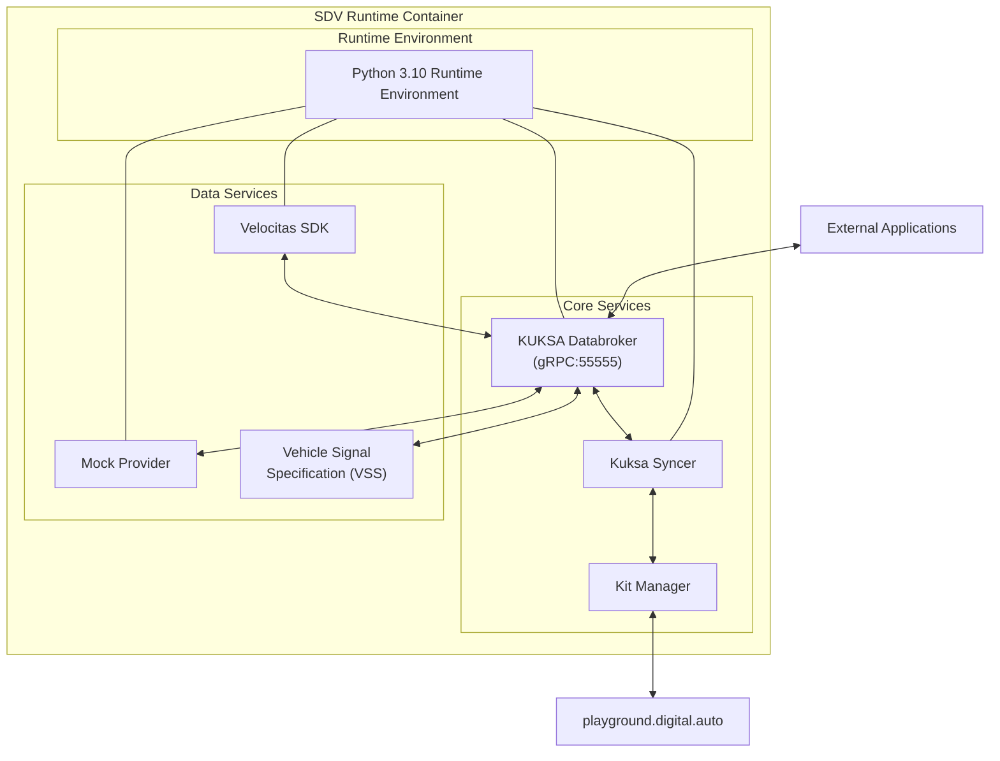
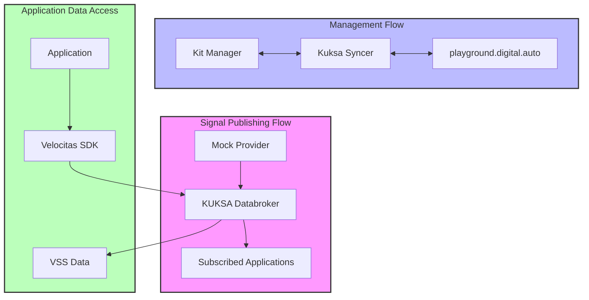
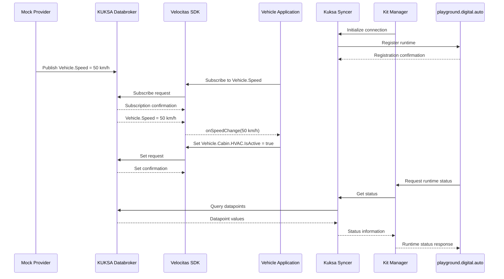

## Table of Contents
1. [Architecture Deep Dive](#architecture-deep-dive)
2. [Component Specifications](#component-specifications)
3. [API Documentation](#api-documentation)
4. [Integration Patterns](#integration-patterns)
5. [Performance Tuning](#performance-tuning)
6. [Security Configuration](#security-configuration)
7. [Advanced Deployment](#advanced-deployment)

## Architecture Deep Dive

### System Architecture



### Data Flow Patterns



#### Detailed Component Interactions



## Component Specifications

### KUKSA.val Databroker

**Version**: 0.4.4  
**Protocol**: gRPC  
**Port**: 55555  

**Configuration Options**:
```toml
[databroker]
address = "0.0.0.0"
port = 55555
metadata_file = "/etc/kuksa/metadata.json"
vss_file = "/vss/vss_release_4.0.json"

[authorization]
enabled = false
jwt_public_key = "/etc/kuksa/jwt.pub.pem"

[tls]
enabled = false
cert = "/etc/kuksa/Server.pem"
key = "/etc/kuksa/Server.key"
```

### Kuksa Syncer

**Purpose**: Runtime registration and synchronization  
**Language**: Python  

**Key Functions**:
- Runtime registration with Kit Manager
- Heartbeat monitoring
- Configuration synchronization
- Event forwarding

**Configuration**:
```python
SYNCER_CONFIG = {
    'server_url': os.getenv('SYNCER_SERVER_URL', 'https://kit.digitalauto.tech'),
    'runtime_name': os.getenv('RUNTIME_NAME'),
    'heartbeat_interval': 30,  # seconds
    'retry_attempts': 3,
    'retry_delay': 5  # seconds
}
```

### Kit Manager

**Purpose**: Runtime orchestration and management  
**API**: REST  
**Port**: 3090 (local mode)  

**API Endpoints**:
```
GET  /api/v1/runtimes              # List all registered runtimes
GET  /api/v1/runtimes/{id}         # Get runtime details
POST /api/v1/runtimes/{id}/config  # Update runtime configuration
GET  /api/v1/runtimes/{id}/status  # Get runtime status
POST /api/v1/runtimes/{id}/logs    # Stream runtime logs
```

### Mock Provider

**Purpose**: Vehicle data simulation  
**Update Frequency**: Configurable (default 100ms)  

**Simulated Signals**:
```python
MOCK_SIGNALS = {
    'Vehicle.Speed': {'min': 0, 'max': 200, 'unit': 'km/h'},
    'Vehicle.Powertrain.CombustionEngine.Engine.Speed': {'min': 0, 'max': 8000, 'unit': 'rpm'},
    'Vehicle.Chassis.SteeringWheel.Angle': {'min': -720, 'max': 720, 'unit': 'degrees'},
    'Vehicle.Cabin.HVAC.Station.Row1.Left.Temperature': {'min': 16, 'max': 32, 'unit': 'celsius'},
    'Vehicle.Powertrain.TractionBattery.StateOfCharge.Current': {'min': 0, 'max': 100, 'unit': 'percent'}
}
```

## API Documentation

### KUKSA.val Databroker gRPC API

**Proto Definition**:
```protobuf
service VAL {
  rpc Get(GetRequest) returns (GetResponse);
  rpc Set(SetRequest) returns (SetResponse);
  rpc Subscribe(SubscribeRequest) returns (stream SubscribeResponse);
  rpc GetMetadata(GetMetadataRequest) returns (GetMetadataResponse);
  rpc RegisterDatapoint(RegisterDatapointRequest) returns (RegisterDatapointResponse);
}

message DataEntry {
  string path = 1;
  Datapoint value = 2;
  Timestamp timestamp = 3;
}

message Datapoint {
  oneof value {
    string string = 1;
    bool bool = 2;
    int32 int32 = 3;
    int64 int64 = 4;
    uint32 uint32 = 5;
    uint64 uint64 = 6;
    float float = 7;
    double double = 8;
    StringArray string_array = 10;
    // ... other array types
  }
}
```

### Velocitas SDK API

**Client Initialization**:
```python
from velocitas_sdk import VehicleApp
from sdv_model import Vehicle

class MyVehicleApp(VehicleApp):
    def __init__(self):
        super().__init__()
        self.Vehicle = Vehicle()
```

**Data Access Patterns**:
```python
# Read data
speed = await self.Vehicle.Speed.get()

# Write data
await self.Vehicle.Cabin.Lights.IsGloveBoxOn.set(True)

# Subscribe to changes
await self.Vehicle.Speed.subscribe(self.on_speed_change)

# Batch operations
await self.Vehicle.update({
    'Cabin.Lights.IsDomeOn': True,
    'Cabin.Lights.AmbientLight': 50
})
```

## Integration Patterns

### 1. Direct gRPC Integration

```python
import grpc
from kuksa.val.v1 import val_pb2, val_pb2_grpc

channel = grpc.insecure_channel('localhost:55555')
stub = val_pb2_grpc.VALStub(channel)

# Get value
request = val_pb2.GetRequest(entries=[
    val_pb2.EntryRequest(path="Vehicle.Speed", fields=[val_pb2.Field.FIELD_VALUE])
])
response = stub.Get(request)
```

### 2. REST Proxy Pattern

```python
from flask import Flask, jsonify
import grpc

app = Flask(__name__)

@app.route('/api/vehicle/<path:signal_path>')
def get_signal(signal_path):
    # Forward to gRPC
    value = get_from_databroker(signal_path)
    return jsonify({'path': signal_path, 'value': value})
```

### 3. WebSocket Bridge

```javascript
const ws = new WebSocket('ws://localhost:8080/ws');

ws.onopen = () => {
    ws.send(JSON.stringify({
        action: 'subscribe',
        path: 'Vehicle.Speed'
    }));
};

ws.onmessage = (event) => {
    const data = JSON.parse(event.data);
    console.log(`Speed: ${data.value} km/h`);
};
```

## Performance Tuning

### Container Resource Limits

```yaml
# docker-compose.yml
version: '3.8'
services:
  sdv-runtime:
    image: ghcr.io/eclipse-autowrx/sdv-runtime:latest
    deploy:
      resources:
        limits:
          cpus: '2.0'
          memory: 2G
        reservations:
          cpus: '1.0'
          memory: 1G
```

### Databroker Optimization

```toml
[performance]
max_connections = 1000
thread_pool_size = 16
cache_size = "256MB"
batch_size = 100

[grpc]
max_receive_message_size = 16777216  # 16MB
max_send_message_size = 16777216     # 16MB
```

### Network Optimization

```bash
# Use host network for better performance
docker run --network=host ...

# Or create optimized bridge network
docker network create --driver bridge --opt com.docker.network.bridge.enable_icc=true sdv-net
```

## Security Configuration

### TLS Configuration

```bash
# Generate certificates
openssl req -x509 -nodes -days 365 -newkey rsa:2048 \
  -keyout server.key -out server.crt

# Mount certificates
docker run -v $(pwd)/certs:/etc/kuksa/certs:ro \
  -e KUKSA_TLS_ENABLED=true \
  -e KUKSA_TLS_CERT=/etc/kuksa/certs/server.crt \
  -e KUKSA_TLS_KEY=/etc/kuksa/certs/server.key \
  ghcr.io/eclipse-autowrx/sdv-runtime:latest
```

### Authentication Setup

```python
# JWT token validation
import jwt

def validate_token(token):
    try:
        payload = jwt.decode(token, PUBLIC_KEY, algorithms=['RS256'])
        return payload['scope'] == 'sdv.runtime.full'
    except jwt.InvalidTokenError:
        return False
```

### Network Policies

```yaml
# Kubernetes NetworkPolicy
apiVersion: networking.k8s.io/v1
kind: NetworkPolicy
metadata:
  name: sdv-runtime-policy
spec:
  podSelector:
    matchLabels:
      app: sdv-runtime
  policyTypes:
  - Ingress
  - Egress
  ingress:
  - from:
    - podSelector:
        matchLabels:
          app: sdv-client
    ports:
    - protocol: TCP
      port: 55555
```

## Advanced Deployment

### Kubernetes Deployment

```yaml
apiVersion: apps/v1
kind: Deployment
metadata:
  name: sdv-runtime
spec:
  replicas: 1
  selector:
    matchLabels:
      app: sdv-runtime
  template:
    metadata:
      labels:
        app: sdv-runtime
    spec:
      containers:
      - name: sdv-runtime
        image: ghcr.io/eclipse-autowrx/sdv-runtime:latest
        env:
        - name: RUNTIME_NAME
          valueFrom:
            fieldRef:
              fieldPath: metadata.name
        ports:
        - containerPort: 55555
          name: databroker
        - containerPort: 3090
          name: kit-manager
        resources:
          limits:
            memory: "2Gi"
            cpu: "2"
          requests:
            memory: "1Gi"
            cpu: "1"
        livenessProbe:
          httpGet:
            path: /health
            port: 3090
          initialDelaySeconds: 30
          periodSeconds: 10
        readinessProbe:
          tcpSocket:
            port: 55555
          initialDelaySeconds: 5
          periodSeconds: 10
```

### Docker Swarm Stack

```yaml
version: '3.8'
services:
  sdv-runtime:
    image: ghcr.io/eclipse-autowrx/sdv-runtime:latest
    deploy:
      replicas: 3
      update_config:
        parallelism: 1
        delay: 10s
      restart_policy:
        condition: on-failure
    environment:
      - RUNTIME_NAME={{.Service.Name}}-{{.Task.Slot}}
    networks:
      - sdv-network
    
networks:
  sdv-network:
    driver: overlay
    attachable: true
```

### Multi-Runtime Orchestration

```python
# orchestrator.py
import docker
import time

class SDVRuntimeOrchestrator:
    def __init__(self):
        self.client = docker.from_env()
        self.runtimes = {}
    
    def spawn_runtime(self, name, config):
        container = self.client.containers.run(
            'ghcr.io/eclipse-autowrx/sdv-runtime:latest',
            detach=True,
            environment={
                'RUNTIME_NAME': name,
                **config
            },
            ports={'55555/tcp': None}  # Random port mapping
        )
        self.runtimes[name] = container
        return container
    
    def scale_runtimes(self, count):
        current = len(self.runtimes)
        if count > current:
            for i in range(current, count):
                self.spawn_runtime(f'runtime-{i}', {})
        elif count < current:
            # Scale down logic
            pass
```

## Monitoring and Observability

### Prometheus Metrics

```yaml
# prometheus.yml
scrape_configs:
  - job_name: 'sdv-runtime'
    static_configs:
      - targets: ['sdv-runtime:9090']
    metrics_path: '/metrics'
```

### Logging Configuration

```python
# logging_config.py
LOGGING_CONFIG = {
    'version': 1,
    'handlers': {
        'console': {
            'class': 'logging.StreamHandler',
            'formatter': 'detailed'
        },
        'file': {
            'class': 'logging.handlers.RotatingFileHandler',
            'filename': '/var/log/sdv-runtime.log',
            'maxBytes': 10485760,  # 10MB
            'backupCount': 5,
            'formatter': 'detailed'
        }
    },
    'formatters': {
        'detailed': {
            'format': '%(asctime)s %(levelname)s [%(name)s:%(lineno)d] %(message)s'
        }
    },
    'root': {
        'level': 'INFO',
        'handlers': ['console', 'file']
    }
}
```

### Health Checks

```python
# health_check.py
from flask import Flask, jsonify
import grpc

app = Flask(__name__)

@app.route('/health')
def health():
    checks = {
        'databroker': check_databroker(),
        'syncer': check_syncer(),
        'kit_manager': check_kit_manager()
    }
    
    status = 'healthy' if all(checks.values()) else 'unhealthy'
    return jsonify({'status': status, 'checks': checks})

def check_databroker():
    try:
        channel = grpc.insecure_channel('localhost:55555')
        grpc.channel_ready_future(channel).result(timeout=5)
        return True
    except:
        return False
```

## Troubleshooting Guide

### Common Issues and Solutions

1. **Databroker Connection Failures**
   ```bash
   # Check if databroker is running
   ps aux | grep databroker
   
   # Test gRPC connectivity
   grpcurl -plaintext localhost:55555 list
   
   # Check logs
   journalctl -u kuksa-databroker
   ```

2. **Mock Provider Not Generating Data**
   ```python
   # Debug mock provider
   import logging
   logging.basicConfig(level=logging.DEBUG)
   
   # Check provider status
   curl http://localhost:8080/provider/status
   ```

3. **Syncer Connection Issues**
   ```bash
   # Test connectivity to kit manager
   curl -v https://kit.digitalauto.tech/api/v1/status
   
   # Check syncer logs
   docker logs <container_id> 2>&1 | grep syncer
   ```

### Debug Tools

```bash
# gRPC debugging
export GRPC_VERBOSITY=DEBUG
export GRPC_TRACE=all

# Network debugging
docker run --rm --network container:<container_id> nicolaka/netshoot

# Process monitoring
docker stats <container_id>
docker top <container_id>
```

## Version Compatibility Matrix

| SDV Runtime | KUKSA Databroker | VSS | Velocitas SDK | Python |
|-------------|------------------|-----|---------------|--------|
| 1.0.0       | 0.4.4           | 4.0 | 0.14.1        | 3.10   |
| 0.9.0       | 0.4.0           | 3.0 | 0.13.0        | 3.9    |
| 0.8.0       | 0.3.1           | 3.0 | 0.12.0        | 3.9    |

---

## Navigation

**Previous**: [Advanced Deployment →](../deployment/)

[Back to Documentation Home](/)